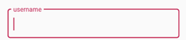
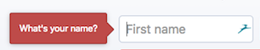
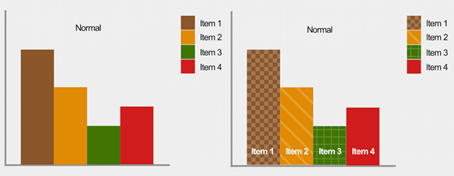

# Opdracht 1.1 - Breek het web
Het Web laten 'breken' door features van het platform bewust uit te zetten. Images, custom fonts, JavaScript, kleur, breedband internet.

## Kleurenblindheid
### Mogelijke problemenn oplossingen
#### Zien van bepaalde foutmeldingen die in kleur zijn aangegeven
Denk bijvoorbeeld aan foutmeldingen in formulieren, een input field die een rode border krijgt kan moeilijk te zien zijn voor iemand die kleurenblind is. 

Een mogelijke oplossing hiervoor is gebruik maken van plain tekst onder het tekstvak of een popover om foutmeldingen duidelijk te weergeven. 

#### Websites met te veel verschillende kleuren kunnen verwarrend zijn
Er zijn bepaalde kleurcombinaties voor mensen met kleurenblindheid die een mogelijk probleem kunnen vormen.
- Groen/rood
- Groen/bruin
- Blauw/paars
- Groen/blauw
- Licht groen/geel
- Blauw/grijs
- Groen/grijs
- Groen/zwart

Het is aangeraden om een simpel kleurenpalet te gebruiken voor een ‘minimal’ design en verwarring te voorkomen.

#### Inzien van grafieken/statistieken die opgedeeld zijn in kleuren
Veel grafieken gebruiken een verschil in kleuren om categorieën op te delen, onderstaande afbeelding is een voorbeeld van een ‘slechte’ grafiek. Dit kan opgelost worden door patronen te gebruiken.
