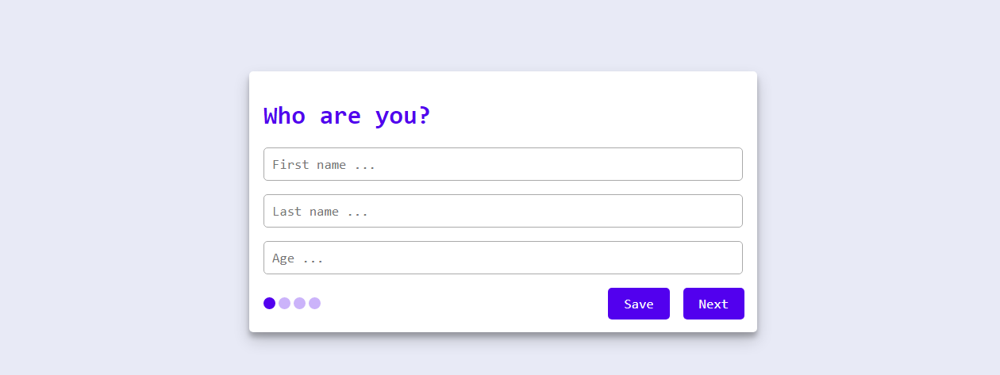

# BT1920 | WebSurv


## Live Demo
[Link](https://bt-michel.herokuapp.com/)

## Use Case
Ik wil een enquete kunnen invullen over de minor Web Development, met verschillende antwoord mogelijkheden. Als ik de enquete niet afkrijg, wil ik later weer verder gaan met waar ik ben gebleven.
- [Opdracht 1.1](./course/Opdracht1.1.md)
- [Opdracht 1.2](./course/Opdracht1.2.md)
- [Opdracht 2](./course/Opdracht2.md)
    - [Layers](./course/Layers.md)

## Installeren
1. Clone repo
    ```
    $ git clone https://github.com/mich97/browser-technologies-1920.git
    ```
2. Move to directory
    ```
    $ cd browser-technologies-1920
    ```
3. Install dependencies
    ```
    $ npm install
    ``` 
4. Run
    ```
    $ npm run start
    ```
5. Open following url in browser
    ```
   localhost:3000
   ```