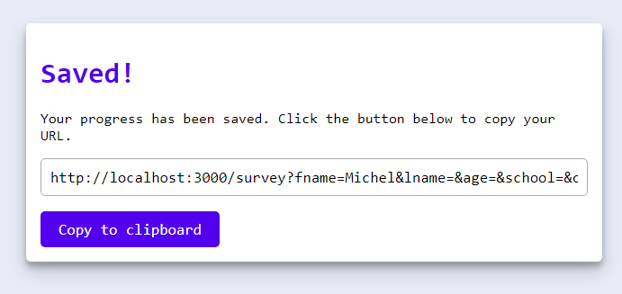
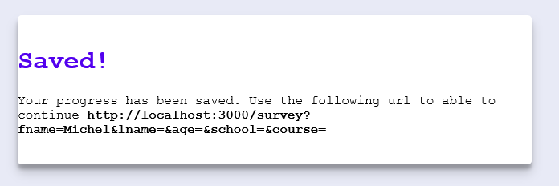

# Feature Detection
Feature detection is het nakijken of de browser een bepaalde functionaliteit/property wel of niet ondersteund, en hiervoor een fallback te schrijven. Omdat mijn applicatie qua CSS alleen maar basic properties gebruikt is het al goed te gebruiken voor de meeste browsers (ook IE), daarom zitten er in mijn styling dus geen fallbacks.

## execCommand
In de 'save' pagina staat er een link van de URL die de gebruiker moet kopiëren. Door middel van ``execCommand`` kan ik met een knop de gebruiker makkelijker de URL laten kopiëren, maar niet elke browser heeft hier ondersteuning voor.



Bovenstaande afbeelding laat zien hoe het eruit ziet zodra er wel ondersteuning is voor ``execCommand``.

Met het volgende stukje code kan ik nakijken of de browser ondersteuning ervoor heeft.

```
if (document.execCommand("copy") == false) {
    document.getElementById("withoutSupport").style.display = "none";
    document.getElementById("withSupport").style.display = "block";
}
```

Door de juiste container te displayen hebben browsers zonder ondersteuning voor ``execCommand`` de volgende weergave.

