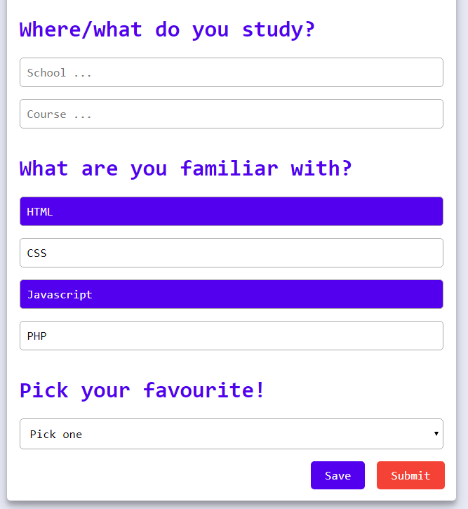

# Feature tests
In dit hoofdstuk worden dezelfde features getest als in opdracht 1.2.

## Features
### Afbeeldingen uitzetten
Geen verandering, de applicatie bevat geen aafbeeldingen.

### Custom fonts uitzetten
Geen verandering, de applicatie bevat geen custom fonts.

### Kleur uitzetten & kleurenblindheid instellen
Bij het testen van de kleurcontrast is gebruik gemaakt van [Checkmycolours](https://www.checkmycolours.com/). De resultaten van de checks zijn op onderstaande afbeeldingen te zien.

Op een kleurverschillen na heeft de applicatie een goed kleurcontrast voor alle elementen en is het dus prima te gebruiken voor iemand met kleurenblindheid.

### Muis/Trackpad werkt niet
Zonder gebruik van muis/trackpad zal de gebruiker met tab door de applicatie moeten navigeren. Op de checkboxes na is het op elke pagina goed te doen.

### Breedband internet uitzetten
Omdat er niks van de applicatie lokaal word opgeslagen, is het ook niet te gebruiken zonder internet. Met een trage 3g verbinding werkt alles nog goed.

### Javascript uitzetten
Zodra javascript uitstaat gaan de functionaliteiten die javascript nodig hebben ook de applicatie uit. In plaats van dat je door categorieën van de views kan navigeren staat alles nu onder elkaar.

### Cookies niet accepteren
Geen verandering, door geen gebruik van cookies.

### Local storage niet accepteren
Geen verandering, door geen gebruik van local storage.