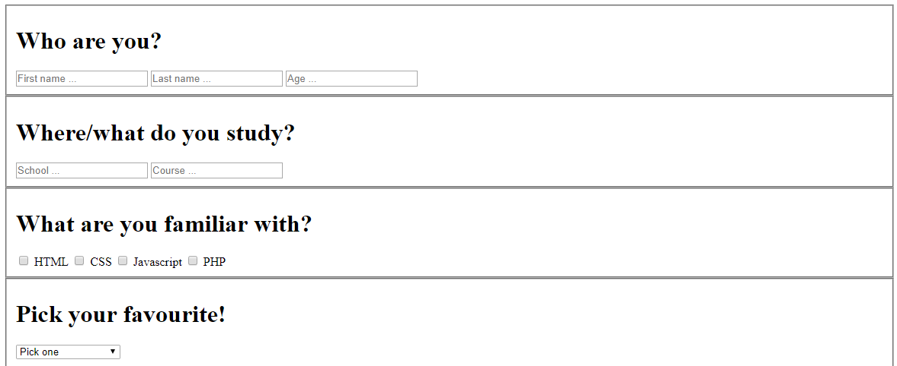
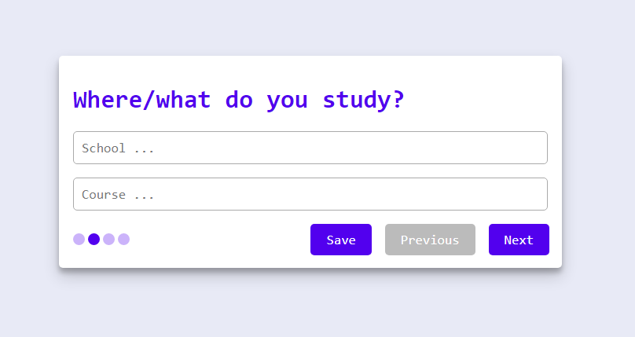

# Functional
Onderstaande afbeelding is hoe de applicatie eruit ziet zonder CSS en Javascript.

Een 'kaal' formulier die er niet heel mooi uitziet maar nog wel overzichtelijk is gemaakt door gebruik van `<fieldset>` tags om te onderscheiden tussen de categorieën. Functioneel doet de applicatie het uiteraard, gebruikers kunnen nog steeds een formulier opslaan of submitten.

# Usable
In de usable laag krijgt de applicatie zijn styling, zodat de gebruiker niet naar een kaal formulier hoeft te kijken. Hierdoor ziet de applicatie er al een stuk overzichtelijker uit. Geselecteerde tekstvakken krijgen een gekleurde outlining en onderstaande knoppen hebben een aparte kleur om duidelijk verschil te weergeven.

# Pleasurable
In de pleasurable laag doen we zoveel mogelijk eraan om de gebruikservaring te optimaliseren. De fieldsets zijn opgedeeld in aparte 'views'. De gebruiker kan naar de volgende/vorige view gaan met de onderstaande knoppen. En links zien we bolletjes staan die de gebruiker laat zien hoever hij/zij in het formulier zit.

 