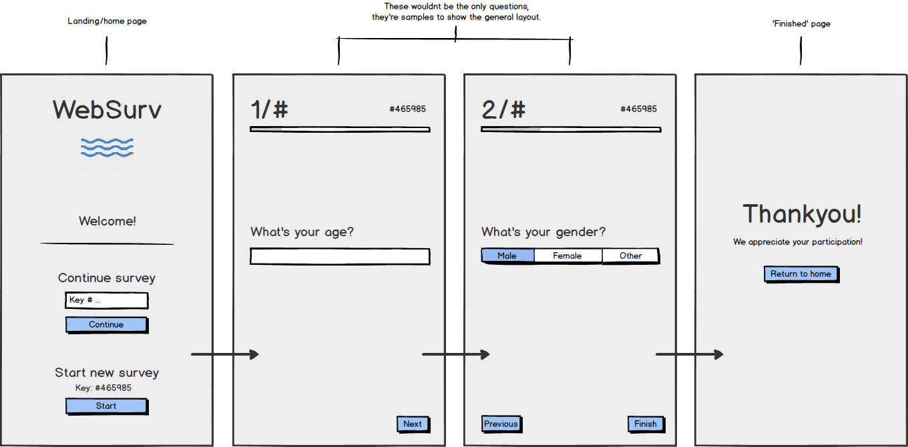

# Opdracht 2 - Progressive Enhanced Browser Technologie
In deze opdracht is het de bedoeling dat we met behulp van Prograssive Enhancement en Feature Detection en online interactieve toepassing maken.

## Use Case
1. Ik wil een enquete kunnen invullen over de minor Web Development, met verschillende antwoord mogelijkheden. Als ik de enquete niet afkrijg, wil ik later weer verder gaan met waar ik ben gebleven.

## Wireframes

## Functional
De applicatie zal bestaan uit html/css en server side javascript, zodat het zonder gebruik van javascript in de browser nog steeds functioneel is.

## Usable
De applicatie heeft een aantal manieren om de usability te verbeteren.
- Vragen indelen op verschillende views
- Progress bar met aantal vragen per pagina
- Knop per pagina om naar de volgende/vorige vraag te navigeren
- Terug knop op de 'finish' pagina

## Pleasurable
In de pleasurable laag zitten alle 'extras' die de gebruikservaring van de applicatie fijner maken. Dit zijn functionaliteiten die niet persé nodig zijn maar wel heel handig zijn om te hebben.